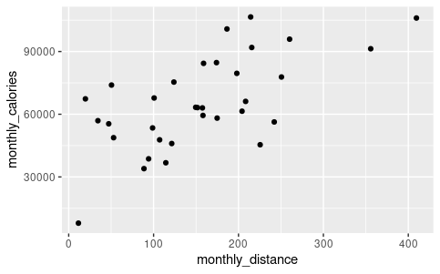

# Bellabeat Case Study: How Can a Wellness Technology Company Play It Smart?

This project was completed as part of the final course of the Google Data Analytics professional certificate on Coursera.

*Tools used were Google Sheets, Big Query, RStudio and Tableau*

## Introduction
Bellabeat is a high-tech manufacturer of wearable smart devices that focus on health metrics in order to empower women to live up to their full potential. To do so it tracks a number of health metrics, including activity, sleep, stress, and reproductive health; this has allowed Bellabeat to empower women with knowledge about their own health and habits.

Founded in 2013, the company has achieved rapid growth and positioned itself as a leader in tech-driven wellness companies, specifically for women. By 2016 the company has expanded to having offices around the world and have developed an ecosystem of wellness trackers, with a focus on improving women’s health.

Leaf: Bellabeat’s stylish health tracker that can be worn as a bracelet, necklace or clip
Time: Bellabeat’s classic looking timepiece that combines smart technology to track health data
Spring: Bellabeat’s smart-tech water bottle that can be used to monitor hydration levels throughout the day.
Bellabeat app: The Bellabeat app provides users with health data related to their activity, sleep, stress, menstrual cycle, and mindfulness habits.

## Ask phase
### Business Task
A junior data analyst working for Bellabeat has been tasked with analysing smart device usage data, from non-Bellabeat products in order to gain insights into the trends of smart device usage. 
These insights will then be applied to one of Bellabeats products in order to see how these insights could be applied to Bellabeat customers and drive future marketing strategies. Urška Sršen, the cofounder and Chief Creative Officer of Bellabeat, believes that these insights could unlock potential future growth for the company.

### The stakeholders include: 
1.Urška Sršen: Bellabeat’s co founder and Chief Creative Officer.  
2.Sando Mur: Mathematician and Bellabeat co founder; key member of the Bellabeat executive team.  
3.Bellabeat marketing analytics team: A team of data analysts who are responsible for collecting, analysing, and reporting data that helps guide Bellabeat’s marketing strategy.  

## Prepare phase
### ROCCC
The data set used for this analysis is the FitBit Fitness Tracker Data (CC0: Public Domain, made available through Mobius): This Kaggle data set contains personal fitness tracker information from thirty fitbit users. Thirty eligible Fitbit users consented to the submission of personal tracker data, including minute-level output for physical activity, heart rate, and sleep monitoring. It includes information about daily activity, steps, and heart rate that can be used to explore users’ habits. The dataset is from a reliable source. Being collected directly from the 30 users that participated, the data is original. With minute level output for each user the data can be considered comprehensive. The data was collected between April 12th and May 12th 2016 so it is outdated and may not reflect the current trends of smart device usage. The data was gathered by Mobius.

### Collecting and organising the data
[The data was downloaded from the following link:]  (https://www.kaggle.com/datasets/arashnic/fitbit/discussion?resource=download&page=3) This data was accessed on the 14th June 2023.

The data set used for this analysis is the FitBit Fitness Tracker Data (CC0: Public Domain, made available through Mobius)

Thirty eligible Fitbit users consented to the submission of personal tracker data, including minute-level output for physical activity, heart rate, and sleep monitoring. It includes information about daily activity, steps, and heart rate that can be used to explore users’ habits.

The folder contains 18 CSV files relating to users activity

## Process phase
### The data at a glance

Started by exploring the various files in Google Sheets. All the csv files have the Id column which will enable easy joining in Big Query.
Renamed all columns to snake case for ease in Big Query.

### Big Query
-- Explore the data --    
SELECT  
  *  
FROM  
  `portfolioproject388206.Bellabeat.daily_activity_merged`  
ORDER BY  
  1,2  
  
This query selects all columns from the daily_activity_merged file, it then orders them first by user and then by date. We now have a data frame that is cleanly organised. This was then exported as a new csv file named daily_activity_cleaned. This table contains 940 rows.

-- Merging the sleep data to the daily_activity_cleaned --    
SELECT    
da.*, sd.minutes_asleep,sd.time_in_bed  
FROM  
  `portfolioproject388206.Bellabeat.daily_activity_cleaned` AS da  
JOIN  
  `portfolioproject388206.Bellabeat.sleep_data` AS sd  
ON da.user_id = sd.user_id  

-- Checking how many users logged sleep --    
SELECT  
  DISTINCT id,  
FROM  
  `portfolioproject388206.Bellabeat.sleep_data`  
WHERE  
  id is not null  

In addition to joining the sleep_table to the daily_activity_merged csv, I also ran a query to see how many users had sleep data, the result was 24 out of the 33 users had monitored sleep.

-- Exploring the weight log csv --  
SELECT  
  DISTINCT user_id  
FROM  
  `portfolioproject388206.Bellabeat.weight_log`  
The result showed only 8 of 33 users had used the weight feature.

-- Exploring the heart rate seconds merged file --  
The table was too large for Excel or Google Sheets to open fully and due to a timestamp issue, could not be opened in Big Query. I therefore loaded the data in RStudio.

install.packages("tidyverse")  
library(tidyverse)  
library(readr)  
head(heartrate_seconds_merged)  
     Id Time                 Value  
       <dbl> <chr>                <dbl>  
1 2022484408 4/12/2016 7:21:00 AM    97  
2 2022484408 4/12/2016 7:21:05 AM   102  
3 2022484408 4/12/2016 7:21:10 AM   105  
4 2022484408 4/12/2016 7:21:20 AM   103  
5 2022484408 4/12/2016 7:21:25 AM   101  
6 2022484408 4/12/2016 7:22:05 AM    95  

heartrate_seconds_merged %>%   
  select(Value) %>%   
  summary()  
Value         
 Min.   : 36.00    
 1st Qu.: 63.00    
 Median : 73.00    
 Mean   : 77.33    
 3rd Qu.: 88.00    
 Max.   :203.00   
n_distinct(heartrate_seconds_merged$Id)  
[1] 14  

At a glance we can see that the dataset contains 3 columns, Id, Time and Value. The rows of the time column represent 5 second intervals. The average recorded heart rate across all users is 77.33, while the minimum is 36.00 and the maximum is 203.00. Additionally we can see that we only have heart rate data for 14 out of the 33 users or 42.42%.

## Analysis phase
As the weight and heart rate columns contain insufficient data for finding useful insights, this analysis will focus on the activity data such as distance, steps, intensities and calories in order to gain insights into user trends.

### daily_activity_cleaned  
-- How many users are tracking activity? --  
SELECT  
  user_id, logged_activities_distance  
FROM  
  `portfolioproject388206.Bellabeat.daily_activity_cleaned`  
WHERE  
  logged_activities_distance > 0  
ORDER BY  
  1  
The result showed only 4 users recorded logged activities

-- Aggregate the data to show user activity for the 30 day period --  
SELECT  
  user_id, ROUND(SUM(total_distance),2) AS monthly_distance, SUM(total_steps) AS monthly_steps, SUM(logged_activities_distance) AS  
 monthly_logged_activities, ROUND(SUM(very_active_distance),2) AS monthly_very_active_distance, ROUND(SUM(moderately_active_distance),2) 
  AS monthly_moderately_active_distance, ROUND(SUM(light_active_distance),2) AS monthly_light_active_distance,  
 ROUND(SUM(sedentary_active_distance),2) AS monthly_sedentary_active_distance, SUM(calories) AS monthly_calories  
FROM  
  `portfolioproject388206.Bellabeat.daily_activity_cleaned`  
GROUP BY  
  user_id  
ORDER BY  
  1  

This table was then extracted as monthly_totals and imported to RStudio for analysis. RStudio will allow for a quick analysis of all columns and create a variety of charts relevant to the analysis. 
-- The following code produced a scatterplot which shows the correlation between calories burned and monthly activity distances --    
library(ggplot2)    
library(readr)    
monthly_totals <- read_csv("monthly_totals.csv")    
View(monthly_totals)    
head(monthly_totals)    
ggplot(data = monthly_totals, mapping = aes(x=monthly_distance,y=monthly_calories))+geom_point()  

